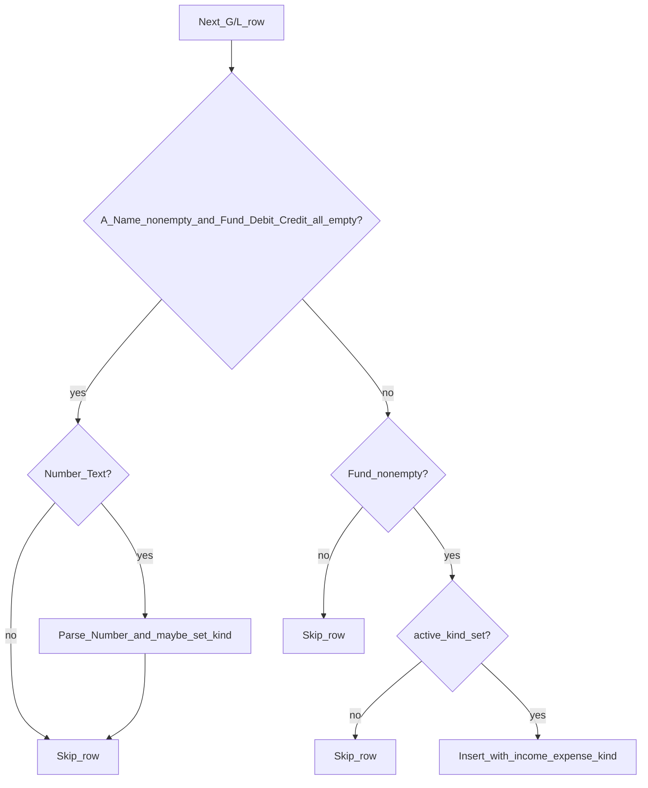

# Fund Activity Detail — Transaction Type 파싱 개발 방안

**작성일**: 2026-05-08  
**대상 파일**: `FUND_DETAIL_LEDGER_XLSX` (General Ledger Special web posting)  
**관련 코드**: [`fund_activity_detail_import.go`](../fund_activity_detail_import.go), [`fund_activity_fiscal_replace.go`](../fund_activity_fiscal_replace.go)

---

## 1. 배경·변경 동기

기존 Detail 적재는 **Fund 열이 비어 있지 않은 모든 행**을 `fund_activity_detail_line`에 넣었고, `transaction_type`은 엑셀 **Type 열(D)** 값을 그대로 저장했다. Name(A)만 있는 행은 임의 문자열로 `account_section`을 갱신했다.

요구사항 변경: **A열 Name의 `Number - Text` 계정 헤더**로 Income/Expense 구간을 판별하고, 다음 헤더가 나오기 전까지 **동일 구간(sticky)** 을 거래 행에 부여한다. Summary UI의 Income/Expenses 드릴다운과 연결된다.

---

## 2. 엑셀 컬럼 매핑 (General Ledger 시트)

| 엑셀 열 | 인덱스 (`rec[]`) | DB/용도 |
|--------|------------------|---------|
| A Name | 0 | 계정 헤더(`Number - Text`)·거래 라벨 |
| B Date | 1 | `line_date` |
| C Transaction # | 2 | `transaction_number` |
| D Type | 3 | `transaction_type` (QB 유형, **유지**) |
| E–H | 4–7 | contact, memo, reference, note |
| I Fund | 8 | `fund_name` (적재 게이트) |
| M Debit | 12 | `debit` |
| N Credit | 13 | `credit` |

---

## 3. 요구사항 (확정)

| # | 규칙 | 동작 |
|---|------|------|
| 1 | A에 값, Fund·Debit·Credit **모두 비어 있음**, `Number - Text` **아님** | 행 **완전 스킵** (`account_section` 미갱신) |
| 2 | `Number - Text` | trim 후 **첫 `-` 앞**을 Number로 추출 (예: `5180 - Payroll` → `5180`) |
| 3 | Number가 `1865`로 시작 **또는** 5120 ≤ Number ≤ 9010 | **Expense** 컨텍스트 설정 |
| 4 | 4300 ≤ Number ≤ 4510 | **Income** 컨텍스트 설정 |
| 5 | 유효한 Income/Expense 설정 후 | **다음 `Number - Text` 헤더 전까지** 동일 kind를 Fund 있는 거래 행에 적용 |
| — | 적재 게이트 | **Fund만 비어 있지 않으면** 적재 (Debit/Credit 0 허용) |
| — | 구간 밖 Number - Text | kind **변경 없음** (이전 kind 유지) |
| — | kind 없는 상태에서 Fund 행 | **적재하지 않음** |

### 구간 겹침

- Income 4300–4510, Expense 5120–9010, Expense prefix `1865` — 서로 겹치지 않음.
- 4511–5179 등: 헤더는 Number - Text이지만 kind 미설정 → sticky만 유지.

---

## 4. 현행 vs 변경

| 항목 | 변경 전 | 변경 후 |
|------|---------|---------|
| Name-only, Fund 비어 있음 | `account_section` 갱신 | Number - Text + 구간 매칭 시에만 section/code/kind 갱신 |
| Name-only, 비 Number - Text | section 갱신 | **스킵** |
| Fund 있는 행 | 무조건 적재 | **active kind 있을 때만** 적재 |
| Income/Expense 분류 | 없음 (UI는 Debit/Credit 휴리스틱) | `income_expense_kind` 컬럼 |
| `transaction_type` | Type 열 | **동일 유지** (QB) |



---

## 5. DB 스키마 권장

### 결론

| 컬럼 | 조치 |
|------|------|
| `transaction_type` | **유지** — QB Type 열 |
| `income_expense_kind` | **신규** — `Income` / `Expense` |
| `account_code` | **신규** — Number - Text에서 추출한 계정 번호 |
| `account_section` | **의미 변경** — 매칭된 `Number - Text` 전체 문자열 |
| `row_label` | 유지 — 거래 행 Name |

마이그레이션: [`20260508130000_add_income_expense_kind/migration.sql`](20260508130000_add_income_expense_kind/migration.sql)

기존 데이터는 fiscal-year replace 재적재로 backfill.

---

## 6. 파싱 알고리즘

```text
activeKind := ""
accountSection := ""
accountCode := ""

FOR each row after header:
  name, fund, debitStr, creditStr := cols 0, 8, 12, 13

  IF name != "" AND fund=="" AND debitStr=="" AND creditStr=="":
    IF NOT isNumberText(name): CONTINUE
    code, ok := parseNumberText(name)
    IF !ok: CONTINUE
    kind := classifyAccountCode(code)
    IF kind != "":
      activeKind = kind
      accountSection = name
      accountCode = code
    CONTINUE

  IF fund == "": CONTINUE
  IF activeKind == "": CONTINUE

  BUILD detailLine with income_expense_kind, account_code, account_section, transaction_type from Type col, ...
  APPEND
```

### 헬퍼

- `isNumberText(s)` — trim, `-` 존재, `-` 앞이 계정 번호 (`5180`, `1865.1` 등 — **소수점 하위 계정 포함**)
- `parseNumberText(s)` — `(code, true)` / `("", false)`
- `classifyAccountCode(code)` — `Income` | `Expense` | `""`

---

## 7. UI/API 영향

[`FundActivitySummary_년도별특별_UI_및_단계별_개발.md`](FundActivitySummary_년도별특별_UI_및_단계별_개발.md) §4 갱신:

| 드릴다운 | 필터 |
|----------|------|
| Income | `income_expense_kind = 'Income'` |
| Expenses | `income_expense_kind = 'Expense'` |

예시 API: `GET …?runId=&fundName=&kind=income|expenses` → `WHERE income_expense_kind IN ('Income'|'Expense')`.

---

## 8. 구현·운영

1. 마이그레이션 적용 (`income_expense_kind`, `account_code`)
2. Go 파서·INSERT 경로 2곳 동기화
3. `ledger_test.go` 테이블 테스트
4. `scripts/run_all_imports.sh --dry-run` 으로 건수·kind 분포 확인
5. fiscal-year replace로 해당 연도 재적재

---

## 9. 검증 체크리스트

- [ ] Number - Text 아닌 Name-only 행 → DB 0건, section 미갱신
- [ ] `5120 - …` (Pension 등) 이후 Fund 행 → `income_expense_kind=Expense`
- [ ] `5180 - …` 이후 Fund 행 → `income_expense_kind=Expense`
- [ ] `4300 - …` 이후 Fund 행 → `Income`
- [ ] 구간 밖 `4600 - …` → kind 변경 없음 (sticky)
- [ ] `18650 - …` (prefix 1865) → Expense
- [ ] kind 설정 전 Fund 행 → 미적재
- [ ] `transaction_type`(QB Type) 샘플 행 보존
- [ ] UI 드릴다운 샘플 펀드 1건 수동 대조

---

## 10. 오픈 이슈

- 4511–5179 계정 헤더: kind 미변경 (의도됨).
- Summary 합계 vs Detail 라인 합 불일치 안내는 UI에 유지.
