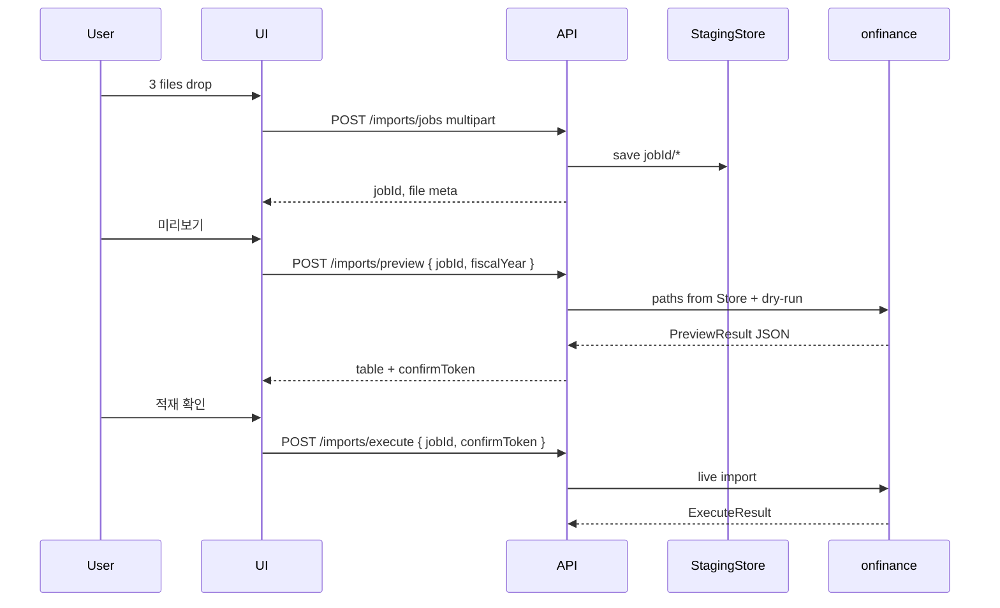
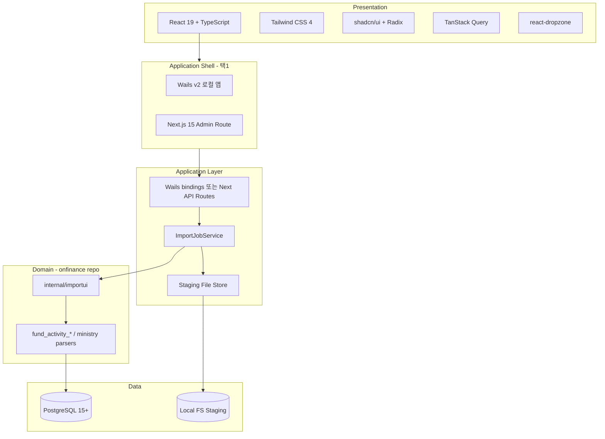
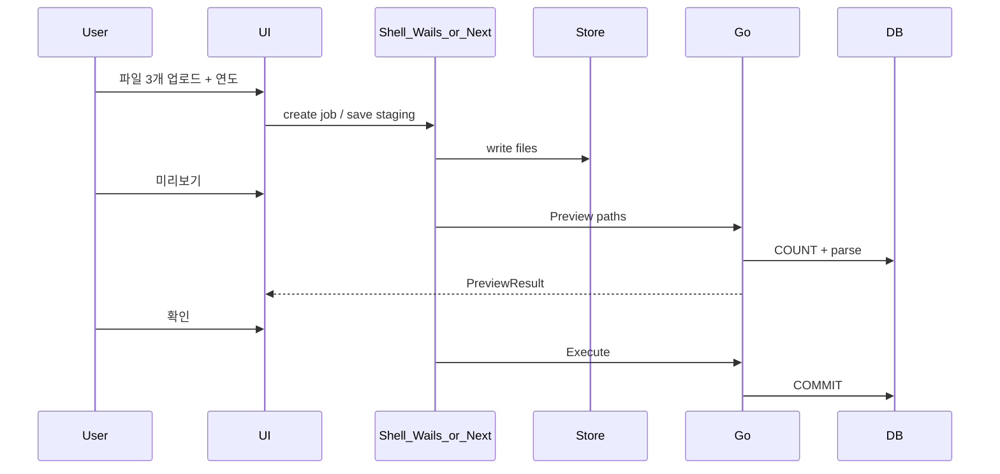

# Import UI — 일괄 적재(dry-run → 확인 → DB) 개발 방안

**작성일**: 2026-05-08 (갱신: 파일 업로드 확정, 기술 스택 상세)  
**목적**: `scripts/run_all_imports.sh` + `run_all_imports.env` 로 하던 **파일 지정 · 미리보기 · 사용자 확인 · DB 적재** 흐름을 UI에서 동일하게 수행.

**결정 사항 (확정)**

| 항목 | 결정 |
|------|------|
| **파일 지정** | **업로드** — 드래그앤드롭 / file picker → 서버(또는 로컬 앱) **job 스테이징 디렉터리**에 저장 후 Go에 경로 전달 |
| 서버 경로 텍스트 입력 | **범위 외** (운영은 CLI `run_all_imports.env` 만 유지) |
| DB 연결 | UI/워커 프로세스가 **Postgres 직접 연결** (`DATABASE_URL`, Prisma와 동일 DB) |
| 적재 엔진 | 기존 **`onfinance` Go** 파서·트랜잭션 재사용 |

**관련 문서**

- 로컬 독립 앱 변형: [`Import_UI_로컬데스크톱_개발방안.md`](Import_UI_로컬데스크톱_개발방안.md)
- CLI: [`scripts/run_all_imports.sh`](../scripts/run_all_imports.sh)
- Detail 파싱: [`FundActivityDetail_TransactionType_파싱_개발방안.md`](FundActivityDetail_TransactionType_파싱_개발방안.md)

---

## 1. 배경

### 1.1 현재 운영 방식

1. `scripts/run_all_imports.env` 에 연도·**절대 경로**·`DATABASE_URL`  
2. `./scripts/run_all_imports.sh` → dry-run → `y/N` → 적재  

### 1.2 변경 목표

| 항목 | 목표 |
|------|------|
| 파일 | UI에서 **3개 xlsx 업로드** + 회계연도 |
| dry-run | DB COUNT + 파싱 건수 **구조화 표시** |
| 확인 | 체크박스·모달 후 적재 |
| 스크립트 | 개발·비상용 **유지** (동일 Go 엔진) |

---

## 2. 적재 대상 (UI 입력)

| UI 슬롯 | Go 플래그 | DB 영향 |
|---------|-----------|---------|
| 회계연도 | `-fiscal-year` | `org_balance.fiscalyear`, `fund_activity_import_run.fiscalyear` |
| 사역원 G/L | `-ministry-ledger-xlsx` | `org_balance` (해당 연도 삭제 후 재삽입) |
| Fund Summary | `-summary-xlsx` | `fund_activity_import_run` + `summary_row` |
| Fund Detail G/L | `-detail-ledger-xlsx` | `detail_line` (fiscal-year **전체 replace**) |

실행 순서: (1) ministry → (2) `-replace-fund-activity-year`.

---

## 3. 파일 지정 — 업로드 (확정)

### 3.1 원칙

- 사용자는 **경로 문자열을 입력하지 않는다.**
- 선택한 파일은 **job 단위 스테이징 영역**에 복사·보관한 뒤, Go importer에 **절대 경로**로 넘긴다.
- preview 성공 후 execute까지 **동일 jobId·동일 스테이징 파일**을 재사용한다 (재업로드 불필요).

### 3.2 업로드 UX

| 요소 | 명세 |
|------|------|
| 입력 | 슬롯 3개: Ministry / Fund Summary / Fund Detail |
| 방식 | 드래그앤드롭 + “파일 선택” (`accept=".xlsx,.xls"`) |
| 검증 | 확장자, MIME(선택), **최대 50MB/파일**, 3개 모두 채워야 미리보기 활성 |
| 표시 | 원본 파일명, 크기, 업로드 시각, SHA-256(선택·감사) |
| 실패 | 개별 슬롯 에러 메시지, 전체 진행 차단 |

### 3.3 스테이징 저장소

**웹 Admin UI (배포 서버)**

```
{DATA_ROOT}/imports/{jobId}/
  ministry.xlsx      # 또는 원본명 보존
  summary.xlsx
  detail.xlsx
  manifest.json      # fiscalYear, uploadedAt, hashes
```

| 항목 | 권장값 |
|------|--------|
| `DATA_ROOT` | 환경변수 `IMPORT_DATA_ROOT` (예: `/var/kcpc/import-data`) |
| `jobId` | UUID v4 |
| TTL | preview 후 **24h** 미실행 시 스케줄 삭제 |
| execute 후 | **7일** 보관 후 삭제 (감사·재현) 또는 즉시 삭제(정책 선택) |
| 권한 | 프로세스 전용 Unix user, 디렉터리 `0700` |

**로컬 데스크톱 앱** — 동일 개념, 경로만 로컬:

```
~/.kcpc/import-ui/jobs/{jobId}/
```

→ 업로드 UX는 동일하고, “서버”가 사용자 Mac/PC 내부 디렉터리일 뿐이다. ([로컬 데스크톱 안](Import_UI_로컬데스크톱_개발방안.md) 참고)

### 3.4 업로드 API 흐름



### 3.5 CLI와의 관계

| 채널 | 파일 지정 |
|------|-----------|
| **Import UI** | 업로드 → 스테이징 |
| **`run_all_imports.sh`** | `run_all_imports.env` 절대 경로 (변경 없음) |

---

## 4. 기술 스택 상세

### 4.1 전체 구성도



### 4.2 레이어별 스택

#### Presentation (공통 — 웹·데스크톱 UI 동일 소스 권장)

| 기술 | 버전(권장) | 역할 |
|------|------------|------|
| **React** | 19.x | 화면·상태 |
| **TypeScript** | 5.6+ | 타입 안전 |
| **Vite** | 6.x | 번들·HMR (`desktop/frontend` 또는 Next와 별도) |
| **Tailwind CSS** | 4.x | 스타일 유틸리티 |
| **shadcn/ui** | latest | Card, Dialog, Table, Button, Progress, Alert |
| **Radix UI** | (shadcn 의존) | 접근성 프리미티브 |
| **TanStack Query** | v5 | preview/execute mutation, job 상태 |
| **react-dropzone** | v14 | 3슬롯 드래그앤드롭 업로드 |
| **Zod** | v3 | 폼·API 응답 검증 |
| **lucide-react** | latest | 아이콘 |
| **Framer Motion** | 11.x | 단계 전환·숫자 강조(절제) |

**폰트 (로컬/WebView)**

- 제목: **Fraunces** 또는 **DM Serif Display**
- 본문: **IBM Plex Sans**
- 로그: **JetBrains Mono**

#### Application Shell — 배포 형태별

| 형태 | 스택 | 언제 |
|------|------|------|
| **A. 로컬 데스크톱 (1순위)** | **Wails v2.9+** + macOS WebView | 운영자 PC, VPN DB, 업로드=로컬 스테이징 |
| **B. Admin 웹** | **Next.js 15** App Router + Route Handlers | 팀 공용 브라우저, 서버 `IMPORT_DATA_ROOT` |

두 형태 모두 **React UI 소스 공유** (`packages/import-ui` 또는 `desktop/frontend` 심링크).

#### Application / API Layer

| 기술 | 역할 |
|------|------|
| **Go 1.22+** | 파서·DB·트랜잭션 (기존 레포) |
| **Wails bindings** (A) | `PreviewImport`, `ExecuteImport`, `UploadFiles` — HTTP 없음 |
| **Next Route Handlers** (B) | `POST /api/admin/imports/jobs`, `preview`, `execute` |
| **multipart/form-data** | 3파일 + `fiscalYear` 수신 |
| **google/uuid** | jobId |
| **crypto/sha256** | 파일 해시(감사) |

#### Domain (`onfinance` 레포)

| 패키지/모듈 | 책임 |
|-------------|------|
| `internal/importui` | `Preview(ctx, params)`, `Execute(ctx, params, token)` |
| `internal/importui/store` | 스테이징 경로 생성·삭제·TTL |
| `internal/importui/types` | `PreviewResult`, `ExecuteResult` JSON |
| 기존 `fund_activity_*`, `main` ministry | 파싱·INSERT (**변경 최소**) |
| `github.com/lib/pq` | Postgres |
| `github.com/xuri/excelize/v2` | xlsx 읽기 |

#### Data

| 기술 | 역할 |
|------|------|
| **PostgreSQL 15+** | Prisma 앱과 동일 DB |
| **로컬 파일시스템** | 업로드 스테이징 (§3.3) |
| **(선택) import_job 테이블** | Prisma/SQL — 이력·상태·preview JSON |

### 4.3 Go 엔진 연동 (단계)

| Phase | 방식 | 설명 |
|-------|------|------|
| **1** | `internal/importui` 패키지 | CLI 로직을 함수로 추출, `-json` stdout |
| **2** | Wails / Next에서 **직접 import** | subprocess 없이 `importui.Preview()` 호출 |
| **3** | (선택) `onfinance` CLI 바이너리 | CI·스크립트용 유지 |

subprocess(`go run`)는 **Phase 1 임시**만; 최종은 **in-process Go 호출**.

### 4.4 주요 npm / go 모듈 (체크리스트)

**frontend `package.json` (핵심)**

```json
{
  "dependencies": {
    "react": "^19.0.0",
    "react-dom": "^19.0.0",
    "@tanstack/react-query": "^5.62.0",
    "react-dropzone": "^14.3.0",
    "zod": "^3.24.0",
    "framer-motion": "^11.15.0",
    "lucide-react": "^0.469.0",
    "class-variance-authority": "^0.7.0",
    "clsx": "^2.1.0",
    "tailwind-merge": "^2.6.0"
  },
  "devDependencies": {
    "typescript": "^5.7.0",
    "vite": "^6.0.0",
    "@tailwindcss/vite": "^4.0.0"
  }
}
```

**Go `go.mod` 추가(예정)**

```
github.com/wailsapp/wails/v2 v2.9.x   # 데스크톱만
github.com/google/uuid
```

### 4.5 개발·빌드 도구

| 도구 | 용도 |
|------|------|
| `wails dev` | 데스크톱 UI+Go 핫리로드 |
| `pnpm` / `npm` | frontend 패키지 |
| `golangci-lint` | Go 정적 분석 |
| `air` (선택) | Go API만 개발 시 |
| `Docker Compose` (선택) | 로컬 Postgres + Admin 웹 |

### 4.6 스택 선정 이유 (요약)

| 선택 | 이유 |
|------|------|
| **업로드 + 스테이징** | 브라우저·OS 경로 차이 제거, job 단위 재현·감사 |
| **Go in-process** | 파서 중복 없음, DB 트랜잭션 일관 |
| **React + shadcn** | dry-run 표·모달·업로드 UX 빠른 구현 + 현대적 UI |
| **Wails (로컬)** | API 서버 없이 직접 DB, 파일 스테이징은 `~/.kcpc/...` |
| **Next (선택)** | 기존 KCPC 웹앱에 Admin 메뉴 통합 시 |

---

## 5. 목표 사용자 플로우



### 5.1 화면 구성

| 단계 | 내용 |
|------|------|
| 1 | DB 연결 테스트(설정), 회계연도 |
| 2 | **업로드 3슬롯** (드롭존) |
| 3 | 미리보기 표 + warnings |
| 4 | 확인 모달 → 적재 + 로그 |

---

## 6. API 설계 (웹 Admin / Next 사용 시)

Base: `/api/admin/imports` · 인증 `finance_admin`

### 6.1 `POST /api/admin/imports/jobs` (multipart)

| 필드 | 타입 |
|------|------|
| `fiscalYear` | number |
| `ministryLedger` | file |
| `fundSummary` | file |
| `fundDetailLedger` | file |

**Response**: `{ jobId, files: [{ slot, originalName, size, stagedPath internal }] }`

### 6.2 `POST /api/admin/imports/preview`

```json
{ "jobId": "uuid", "fiscalYear": 2026 }
```

**Response**: `PreviewResult` (§6.4)

### 6.3 `POST /api/admin/imports/execute`

```json
{ "jobId": "uuid", "confirmToken": "sha256...", "acknowledgedWarnings": true }
```

### 6.4 `PreviewResult` / `ExecuteResult` (공통 스키마)

Go struct ↔ TypeScript Zod schema **동일 생성** 권장.

```json
{
  "jobId": "uuid",
  "fiscalYear": 2026,
  "ministry": {
    "fileName": "GeneralLedger.20260508.xlsx",
    "orgBalancePlannedDelete": 1200,
    "orgBalancePlannedInsert": 1180
  },
  "fundActivity": {
    "summaryFileName": "FundActivitySummary.20260508.xlsx",
    "detailFileName": "GeneralLedger.Special.20260508.xlsx",
    "periodStart": "2026-01-01",
    "periodEnd": "2026-04-30",
    "plannedDelete": { "importRun": 1, "summaryRow": 31, "detailLine": 4500 },
    "plannedInsert": { "importRun": 1, "summaryRow": 31, "detailLine": 4200, "detailIncome": 800, "detailExpense": 3400 }
  },
  "warnings": [],
  "errors": [],
  "confirmToken": "hex-sha256"
}
```

---

## 7. 데이터·감사

```prisma
model ImportJob {
  id             String   @id @default(uuid())
  fiscalYear     Int
  status         String   // staged | previewed | running | completed | failed
  stagingDir     String   // 서버 경로 (웹) 또는 상대 jobId (로컬)
  ministryName   String?
  summaryName    String?
  detailName     String?
  previewPayload Json?
  confirmToken   String?
  createdBy      String?
  createdAt      DateTime @default(now())
  expiresAt      DateTime?
  completedAt    DateTime?
  errorMessage   String?
}
```

---

## 8. 보안·운영

| 항목 | 요구 |
|------|------|
| 업로드 | `.xlsx` only, 50MB/파일, jobId UUID 경로 traversal 방지 |
| 저장 | `IMPORT_DATA_ROOT` 외 쓰기 금지 |
| DB | 스테이징 DB 권장(preview도 실 COUNT) |
| 동시성 | 동일 `fiscalYear` running job 1개 |
| 비밀번호 | env / secret manager; UI에 저장 시 암호화 |

---

## 9. 구현 로드맵

### Phase 0 — 확정 (완료)

- [x] 파일 입력: **업로드**
- [ ] Shell: Wails vs Next 최종(로컬 우선 시 Wails)

### Phase 1 — Go `internal/importui` (1주)

- [ ] Preview / Execute / types
- [ ] Staging store 인터페이스
- [ ] `-import-all-preview` / `-import-all-execute` + JSON

### Phase 2 — 업로드 + 스테이징 (1주)

- [ ] `POST jobs` multipart 또는 Wails `StageFiles([]byte)` 
- [ ] TTL 정리 goroutine/cron

### Phase 3 — UI (1–1.5주)

- [ ] 3 dropzone + 미리보기 테이블 + 확인 모달
- [ ] TanStack Query mutations

### Phase 4 — 배포·문서 (0.5주)

- [ ] `wails build` 또는 Vercel/내부 서버
- [ ] Runbook

---

## 10. 오픈 이슈

1. Ministry `fiscalYear` — `main.go` 상수와 UI 연도 플래그 정합.  
2. 부분 적재(ministry만) — 초기 범위 외.  
3. 업로드 파일 execute 후 보관 기간(즉시 삭제 vs 7일).

---

## 11. 요약

- **파일 지정은 업로드만** 사용한다. 스테이징 후 Go에 경로를 넘긴다.  
- **기술 스택**: React 19 + TS + Tailwind 4 + shadcn + react-dropzone + TanStack Query + **Go `internal/importui`** + Postgres; 셸은 **Wails(로컬)** 또는 **Next Admin(웹)**.  
- **CLI**는 env 경로 방식 유지.
